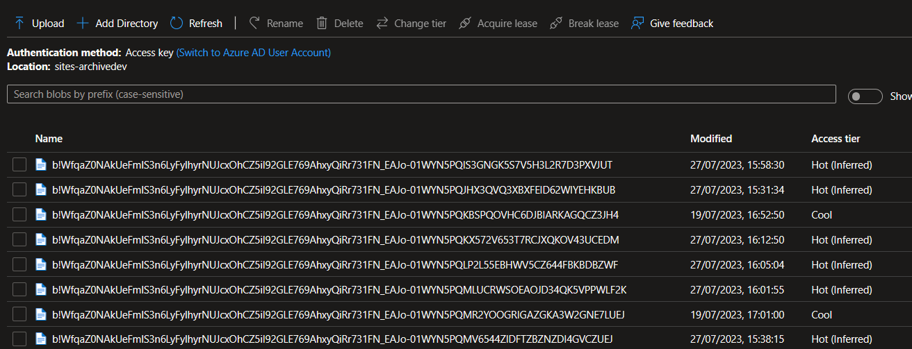
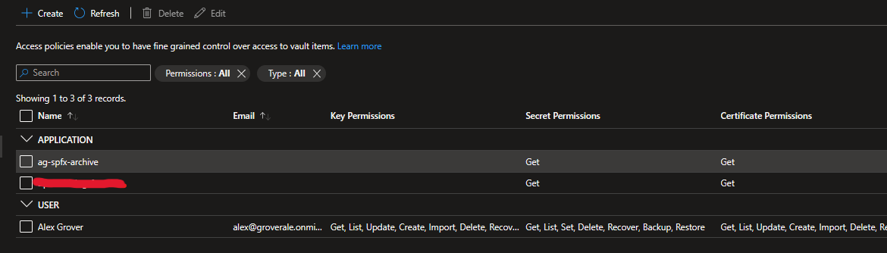

# SPFx Self Service Archival

This solution has been developed to demonstrate a method to add self service archival functionality to SharePoint. This is low cost, low maintenance, simple solution. The following features are supported

* Dynamic Metadata
* Permission maintained
* Version Support
* Searchability maintained (content with Graph Connector)
* All File Types
* Maintains last modified / created dates and users
* Fast / Background processing
* Roll Back
* Easy Deployment

The diagram below provides a general overview of the solution.


The solution contains five components:

* App Registration          (Context)
* SPFx ListView Extension   (Fontend / UI)
* Azure Function            (API)
* Azure Storage Account     (Storage tier)
* Key Vault                 (Certificate storage)
* Graph Connector           (Content Search)

The front end to the solution could easily be swapped out to something else, a script, a bot even a PowerAutoamte trigger. The SPFx List extension simply posts a data payload to the Azure Function to identify the file that should be archived. Anything that can replicate this functionality can be used.

## App Registration

The app registration is the identity of the Azure Function. The SPFx ListView component runs in the context of the user so does not require an app registration / identity.

The following application permissions are required:

    MSGraph 	Files.ReadWrite.All
	SharePoint 	Sites.FullControl.All

These permission provide the Azure Function the ability to read, create and delete files in every Library in every site. A combination of MSGraph and SharePoint permissions are required as the solution utilizes both of the APIs.

A certificate is used by the Azure Function to obtain a context / connection using the app registration. The certificates public key (.cer) must be uploaded to the App registration.

The certificate private key (.pfx) is stored in the Key Vault, the Azure Function obtains the certificate from the Key Vault when it establishes a connection with M365. 

## SPFx ListView Extension

SharePoint Framework (SPFx) is a modern development model and set of tools provided by Microsoft for creating customizations and solutions for SharePoint. It allows you to build web parts, extensions, and other custom components using popular web technologies like TypeScript, JavaScript, HTML, and CSS. SPFx offers improved performance, easy integration with Microsoft services, and flexible deployment options, making it a powerful and modern way to extend and customize SharePoint.

A ListView extension, also known as a ListViewCommandSet, is a type of SharePoint Framework (SPFx) extension that allows you to customize the command bar and context menu of a SharePoint list or library. By creating a ListView extension, you can add custom actions, buttons, and menu items to enhance the user experience and provide additional functionality when working with list items or documents. ListView extensions are client-side components that are rendered within the SharePoint interface, providing a seamless and integrated customization experience.

The solution utilizes SPFx ListView Extensions to add two additional buttons to both the command bar and context menu. These buttons are as follows:


These buttons simply make a post request with the relevant selected item information to the Archiving API (Azure Function)

Example payload below:

```typescript
const body: string = JSON.stringify({
    'spItemUrl': spItemUrl,
    'fileLeafRef': fileLeafRef,
    'serverRelativeUrl': serverRelativeUrl,
    'siteUrl': this.context.pageContext.web.absoluteUrl,
    'fileRelativeUrl': fileRef,
    'archiveVersions': this.properties.archiveVersions,
    'archiveVersionCount': this.properties.archiveVersionCount,
    'archiveMethod': ARCHIVE_METHOD,
    'archiveUserEmail': this.context.pageContext.user.email,
    'associatedLabel': 'todo'
});
```

If more than one file is selected then multiple requests are sent to the API - One request per file.

### Client Side Settings (Versions)

There are two settings that can be applied to the extension. These settings control if previous versions will be archived. The settings will apply to a site where the extension has been deployed. I.e This settings is to be configured on a site by site basis.

By default versions are not archived.

```json
"properties" : {
    "archiveVersions": false,
    "archiveVersionCount": 0
}
```

To update these settings to a deployed version of the extension on a Site Collection you can use the following PowerShell:

```powershell
Set-PnPApplicationCustomizer -ClientSideComponentId aa66f67e-46c0-4474-8a82-42bf467d07f2 -Scope Site -ClientSideComponentProperties '{"achiveVersions": true, "achiveVersionCount": 10 }'
```

This will have the following effect on the solution config. But remember this will only apply to the site that the above command was ran on.

```json
"properties" : {
    "archiveVersions": true,
    "archiveVersionCount": 10
}
```

## Archiving API (Azure Function)

Azure Functions is a serverless compute service offered by Microsoft as part of its Azure cloud platform. It allows you to run code in response to events without the need to manage the underlying infrastructure.

Being serverless, we don't need to worry about scalability. Azure Functions will automatically scale based on the number of incoming events. As the event load increases, the platform can scale out to handle the load efficiently. This ensures that the archiving API remains responsive and performant.

SharePoint Online, MSGraph and Azure Storage Accounts all have `dotnet` SDKs, therefore it was decided to write this function in `C#`. 

### App Settings

The function has a number of `appSettings` that are required for the API to work. Sample app settings are below:

#### Auth

As already discussed the Azure function uses an app registration to authenticate to SharePoint and MSGraph. The details are configured in the four app settings below:

```json
"clientId": "731dfd10-2052-4390-b4c2-178bff6a8196",
"tenantId": "75e67881-b174-484b-9d30-c581c7ebc177",
"thumbprint": "BD4D7AC2DBCD010E04194D467AC996F486512A49",
"sharepointDomain" : "groveale.sharepoint.com",
```

The certificate that the app registration uses is stored in an Azure KeyVault. They certificate is uploaded to the KeyVault as a secret and is accessed using it's name. An access policy is configured on the KeyVault to only allow the Azure Function access to certificate.

```json
"keyVaultName": "ag-spfx-archive-kv",
"certNameKV": "function",
```

#### Logging

All actions are logged to a SPO list - This list must exist on the site specified by the `archiveHubUrl` parameter.

```json
"archiveHubUrl": "https://groverale.sharepoint.com/sites/AchiveHub",
"archiveHubListName": "ArchiveLog",
```

The details of the this list are:


#### Stub

The API creates a Stub .txt file in place of the archived item. This stub contains a message stating that the file has been archived with a link to a page that should explain the process of Archiving and Rehydrating. This link is specified in the `linkToKB` parameter

```json
"linkToKB": "https://learn.microsoft.com/en-us/graph/api/driveitem-post-children?view=graph-rest-1.0&tabs=csharp",
```

#### Archive

The Archive is a gen2 storage account that has versioning enabled. The API uses a connection string to write files to blob storage. This connection string should be added to the KeyVault for production - TODO

```json
"StorageConnectionString": "DefaultEndpointsProtocol=https;AccountName=agversioning;AccountKey=**8**;EndpointSuffix=core.windows.net"
```

### Functions

The API contains two HTTP trigger functions. One for Archiving and one for Rehydrating. Both function contain the same code but the sequencing is reversed. The Archive function will get the files from SPO, create the file in the blob storage, create the Stub in SPO, apply the metadata to the Stub and finally delete the original file in SPO. 

The Rehydrate function will get the file from blob (using the file ids of the stub), stream the content of the file in blob to a new file in SPO. Apply the metadata from the stub to the new file in SPO and finally delete both the blob and the stub.

> **Note**
>
> If a stub is deleted from SPO it will be almost impossible to recover a file from the Archive. The Stub is the key to the archive location. 

### Identity

A system assigned managed identity is required for the function. This is used to grant permissions to the KeyVault that holds the certificate used to connect to M365. It's also possible to reuse this identity as the app registration that is used to connect to M365. 

The managed identity is authenticated with Azure AD, so there is no need to store any credentials in code.


### Conflicts

It's possible that naming conflicts will occur, both when Archiving and Rehdrating. The example below shows a word document called `Document.docx`. In this instance a user has rehydrated a file which was also called `Document.docx` - There is now a naming conflict, the API generates a GUID and adds the first 8 characters of the GUID to the filename. 

We also have an archived file that was called `v1.docx` (some terrible document names in this example). Let's say another document was created with the same name and now it needs to be archived. When the API attempts to create the stub there will be a conflict. So again, the API generates a GUID and adds the first 8 characters of the GUID to the filename.

These two examples can be seen in the screenshot below:


## Azure Storage Account

Azure Storage Gen2 Account is used as the data layer of the solution. 

### Structure

A container is created for each site collection in the storage account. This is to ensure uniqueness at the container level.

The container name must be lowercase and can only contain hypernymns. Therefore '/' are replaced with '-' and then non compliant characters are stripped using the following `Regex` 

```c#
public static string StripNonCompliantCharacters(string input)
{
    // Use a regular expression to remove all non-compliant characters
    return Regex.Replace(input, @"[^a-z\-]", "");
}
```

Example container structure:


> **Note**
>
> If a site URL is changed then all archived will not be able to be recovered by the user. This will be a cumbersome admin activity. It is not recommended to change the URL of sites that contain archived files 

Within the site collection container the blobs are named `{driveId}-{drivItemId}`.This is again to ensure uniqueness at the blob level within the containers. Each Library (Drive) within a site has a unique `driveId` and each document (driveItem) within a library has a unique `driveItemId`. 

This structure is how a user can rehydrate a file. The driveItemId is actually the driveItemId of the stub file rather than the archived file. This means that as long as the Stub is intact a user will always be able to bring back a file from the archive.

Example blob structure:



> **Note**
>
> If a stub is deleted then it will be very difficult to recover the archived file without cumbersome admin activity. 

### Versioning

The Storage account must have versioning switched on to support archiving versions. The version config is included in the payload of the request that is sent to the API. Version config needs to be configured on the invocation method.

### Metadata (TODO)

Metadata is also stored on the archived blobs. This includes:

* File Name
* File Extension
* Site Url
* Site Relative Url
* Creator (User)
* Editor (User)
* Archiver (User)
* Archive date (DateTime)
* Last Modified (DateTime)

This metadata does not include all SPO metadata as this is stored on the stub. This metadata is captured to better support searching via Graph Connector.

### Access

The API accesses the storage account using a connection string. It is recommended that users are not given direct access to the blobs. Only th API should have access to the storage account.

### Blob Life Cycle

A number of blob access rules should be configured to move blobs to cheaper storage. This will decrease the monthly reoccurring cost of the blob storage. These rules are configured in the storage account Lifecycle Management blade.

Example rule:


Moving blobs to cheaper storage will increase the rehydrate time.

## Key Vault 

Azure Key Vault is a cloud service for securely storing and accessing secrets. A secret is anything that you want to tightly control access to, such as API keys, passwords or certificates. In our case we will be using the Key Vault to store the certificate that the Azure function uses to access M365.

An access control policy should be set up on the Key vault to ensure that the Azure function has permission to access the certificate.

The policy simply needs to give the principal that represent azure function Get permission for both Secrets and Certificates.



> **Note**
>
> The Storage Account connection string should also be stored in the KeyVault. This change will be made in a subsequent release

## Search

Search is important as whilst the files have been archived as they are deemed no longer needed. It may still be necessary to find an archived file. There will be a number of options to do this. The stub will be in the same place that the archived file was, if the user knows they archived a file they can rehydrate it from the stub. Any user can rehydrate a file from a stub, as long as they have access to the stub.

### Microsoft Search

Microsoft Search will still be a search option. All metatdata that was applied to the archived file will be searchable as it's now applied to the stub. If a user can find the stub, they will have the ability to rehydrate the archived file.

> **Note**
>
> As all the content of the file is now in archive, the content of the file will not be searchable using Microsoft Search, only the file metadata.

### Graph Connector

A Graph Connector can be configured to provide content search for the files in archive. The Azure Data Lake Storage Gen2 Microsoft Graph connector allows user  to search for files stored in Azure Blob Storage and Azure Data Lake Gen 2 Storage accounts. Details on how to set up and configure the connector can be found [here](https://learn.microsoft.com/en-us/microsoftsearch/azure-data-lake-connector).

Once the Graph connector has been set up, the archived files will be included in the MSGrap sematic index so will be available to `copilot` users.

With Graph Connectors it's possible to customise the Search result experience using Adaptive Cards. This means we are able to include direct links to the content in SPO from the search result. A user can click the result and be taken to SharePoint and can rehydrate the file (if required).


> **Note**
>
> It might be necessary to create a custom connector to support the above